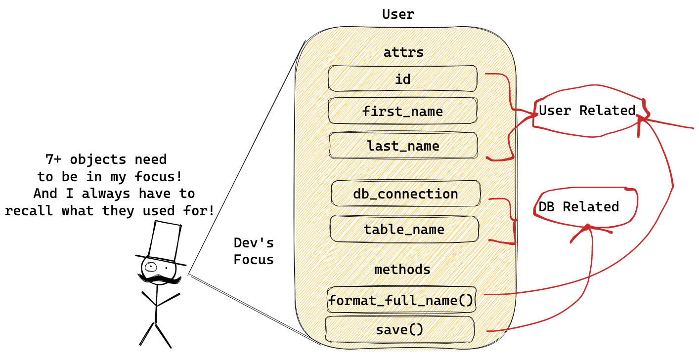
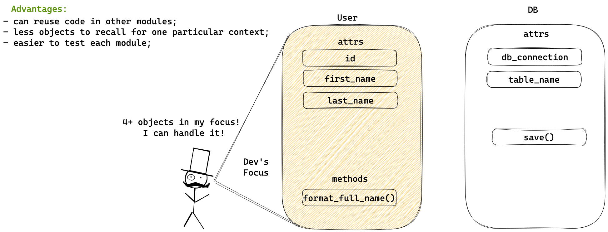
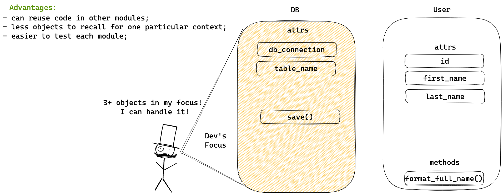

## SOLID

SOLID is an acronym meaning OOP principles for building software applications that ease your experience with growing app codebase.
It's not a set of rules. You shouldn't treat them as a set strict rules, but as principles.

### Goals
Those principles allow us to build flexible and maintainable software.
They can reduce complexity of your growing applications.

### Meaning

The acronym stands for 5 principles:

- **S**ingle Responsibility;
- **O**pen/Closed;
- **L**iskov Substitution;
- **I**nterface Segregation;
- **D**ependency Inversion.

### Single Responsibility

A class or module should have one, and only one, reason to be changed.

#### How helps
* reduces amount of objects inside each context;
* less objects is easier to remember and operate;
* less objects is easier to test;
* less objects is easier to change, means less connections between other parts of the code;

Separating user and db related code helps to reduce complexity of the program.

